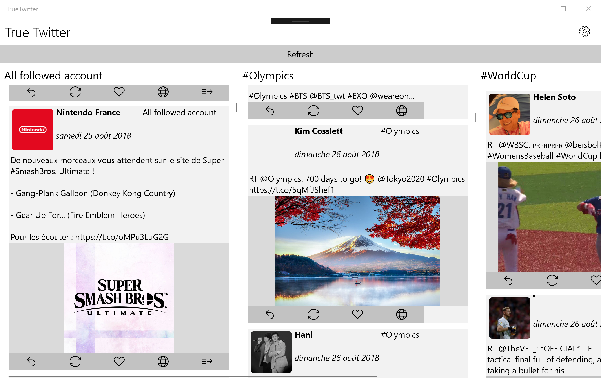
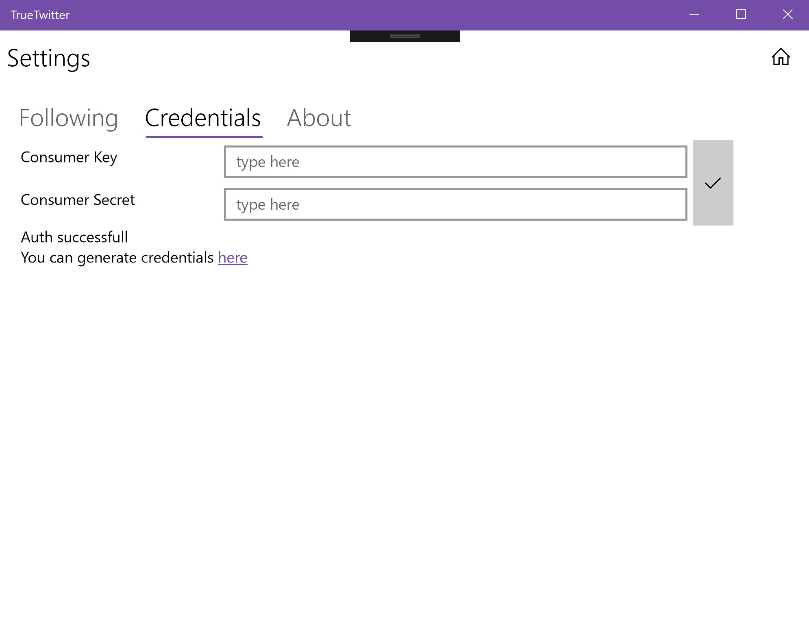

# True Twitter

True twitter is a simple project that aims one thing : display the twitter you want

The goal is to bypass the mecanism of tweet selection in your twitter flux run by twitter. Another goal is to prevent Twitter to show you "In case you missed it" and to prevent Twitter from reordering your flux.

The app works with App-Authenticated credentials.

Use Tweetinvi to query Twitter

Made for Windows via UWP (not tested in Mobile but should work).

## Known bug

1. Crashes when there's no internet connection

2. Crashes when a non existing user is queried.

3. The app freezes just after update as UWP tries to download all images.

## F.A.Q

1. How to generate 'consumer key' and 'consumer secret' ?

Go to https://apps.twitter.com/app/new

## Screenshots

## License

License: MIT license